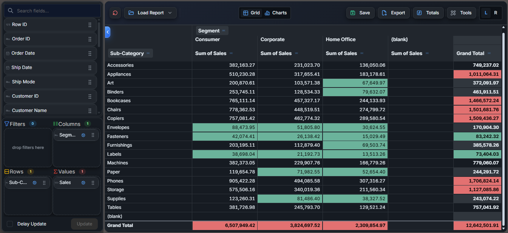
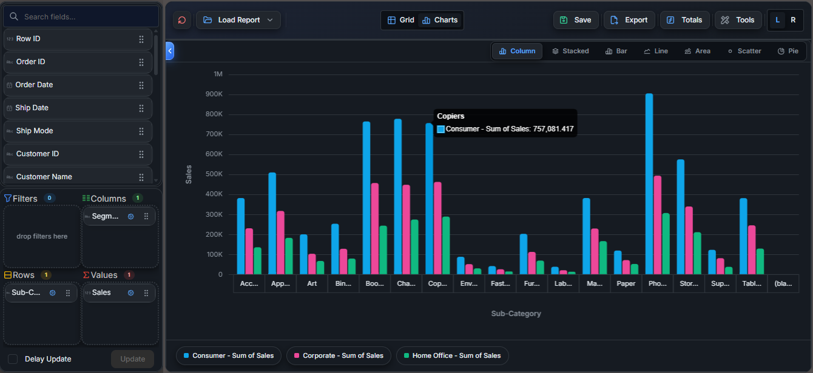

# AeroPivot Examples — JavaScript Pivot Table Web Component for React, Vue, Angular and Vanilla JS

Examples, integration notes, and benchmark methodology for the [AeroPivot JavaScript pivot table web component](https://kasmav.com/aeropivot).

AeroPivot is a high-performance framework-agnostic pivot table web component for React, Vue, Angular, Next.js, Svelte, and plain JavaScript applications. It is built for embedded analytics, BI dashboards, browser-local CSV/JSON/Arrow/Parquet pivoting, pivot charts, exports, and optional DuckDB server mode. It is designed for developers who need a framework-agnostic alternative to traditional JavaScript pivot grid and BI components.

This repository is a public companion kit. It does not contain the proprietary AeroPivot SDK bundle. It contains examples and benchmark material that help developers evaluate and integrate AeroPivot in real applications.

## Who This Repository Is For

This repository is for developers evaluating:

- a JavaScript pivot table component for web applications
- a React pivot table component for dashboards
- a Vue or Angular pivot table integration
- a framework-agnostic pivot table web component
- browser-local CSV, JSON, Arrow, or Parquet analytics
- large dataset pivot tables with Web Workers
- server-side pivot aggregation with DuckDB

## Quick Links

- [AeroPivot product page](https://kasmav.com/aeropivot)
- [Live pivot table demo](https://kasmav.com/aeropivot/demo)
- [Documentation](https://kasmav.com/aeropivot/docs)
- [Integration guides](https://kasmav.com/aeropivot/docs/guides)
- [10 million row JavaScript pivot table benchmark](https://kasmav.com/aeropivot/benchmarks/10-million-row-pivot-table)
- [Download the 30-day trial](https://kasmav.com/aeropivot/download)
- [Pricing](https://kasmav.com/aeropivot/pricing)

## What Is Included

| Path | Purpose |
| --- | --- |
| `examples/react` | Runnable React + Vite example using the `<pivot-table>` web component. |
| `examples/vanilla-js` | Plain HTML and JavaScript example for direct browser integration. |
| `examples/vue` | Vue 3 integration pattern with refs, setup timing, and custom events. |
| `examples/angular` | Angular integration pattern with `CUSTOM_ELEMENTS_SCHEMA` and `ViewChild`. |
| `benchmarks/10m-row-browser-pivot` | Dataset generator, benchmark checklist, methodology, and results template. |
| `docs/integration-notes.md` | Practical Web Component integration notes across frontend frameworks. |
| `docs/performance-methodology.md` | How to measure ingestion, recalculation, memory, and responsiveness fairly. |

## Screenshot Dashboard Integration (in Dark Theme)





## Getting Started

1. Download the AeroPivot trial from [kasmav.com/aeropivot/download](https://kasmav.com/aeropivot/download).
2. Copy these SDK files into the example project you want to run:

   ```txt
   pivot-table.es.js
   pivot-themes.css
   assets/pivot.worker.js
   ```

3. Add your trial or production license key where the examples show:

   ```txt
   YOUR_LICENSE_KEY_HERE
   ```

4. Run the example or adapt the snippets for your application.

## React Pivot Table Example

The React example is the best starting point if you are evaluating AeroPivot in React, Vite, or Next.js-style applications.

```bash
cd examples/react
npm install
npm run dev
```

Before running it, copy the AeroPivot SDK files into:

```txt
examples/react/public/aeropivot/pivot-table.es.js
examples/react/public/aeropivot/pivot-themes.css
examples/react/public/aeropivot/assets/pivot.worker.js
```

React should use a native ref to pass large data and configuration objects into the custom element:

```tsx
const pivotRef = useRef<PivotElement | null>(null);
```

This avoids pushing large datasets through React props or string attributes.

## Vanilla JavaScript Pivot Table Example

The vanilla JavaScript example is useful for static sites, PHP, Django, Rails, Laravel, ASP.NET Razor, and server-rendered applications.

Open:

```txt
examples/vanilla-js/index.html
```

Before opening it, copy the AeroPivot SDK files into:

```txt
examples/vanilla-js/aeropivot/pivot-table.es.js
examples/vanilla-js/aeropivot/pivot-themes.css
examples/vanilla-js/aeropivot/assets/pivot.worker.js
```

## Vue And Angular Examples

The Vue and Angular folders contain framework-specific integration patterns:

- Vue 3: template refs, `onMounted`, and custom event bindings
- Angular: `CUSTOM_ELEMENTS_SCHEMA`, `ViewChild`, and native element setup

These examples intentionally focus on the integration surface rather than packaging a full demo app for every framework.

### AeroPivot Ingestion & Aggregation: 10M Rows (in Light Theme)

https://github.com/user-attachments/assets/1544fccd-2618-4913-bd32-45bc0132422f

## 10M Row Browser Pivot Benchmark Kit

The benchmark folder helps you test large browser-local pivot workloads with a repeatable dataset and a fair measurement process.

Start here:

```txt
benchmarks/10m-row-browser-pivot/README.md
```

Generate a small smoke-test dataset:

```bash
node benchmarks/10m-row-browser-pivot/generate-dataset.mjs --rows 100000 --out sales-100k.csv
```

Generate a larger dataset:

```bash
node benchmarks/10m-row-browser-pivot/generate-dataset.mjs --rows 10000000 --out sales-10m.csv
```

The public benchmark article is available here:

[10 Million Row JavaScript Pivot Table Benchmark](https://kasmav.com/aeropivot/benchmarks/10-million-row-pivot-table)

## Benchmark Caveats

Do not compare pivot components using only row count. A 10 million row low-cardinality sales dataset behaves very differently from a 10 million row event table with unique IDs, long strings, timestamps, URLs, or many simultaneous measures.

When publishing results, report:

- browser and operating system
- CPU and RAM
- file size
- row count and field count
- selected rows, columns, values, and filters
- field cardinality
- ingestion time
- recalculation time after ingestion
- memory pressure or browser limits observed

## Local Mode vs Server Mode

Use browser-local mode when users work with bounded extracts or uploaded files that can safely live in browser memory.

Use DuckDB server mode when:

- source data should stay on your backend
- data volume exceeds practical browser memory
- access control and tenant boundaries matter
- users should receive aggregate result windows instead of raw source data

Server mode docs:

[AeroPivot DuckDB server mode](https://kasmav.com/aeropivot/docs/server-mode)

## Important Licensing Note

The files in this repository are MIT licensed companion examples and benchmark scripts.

AeroPivot itself is commercial software. The SDK bundle, trial license, production license, and commercial use rights are governed by the AeroPivot license terms.

Download the trial:

https://kasmav.com/aeropivot/download

## Useful Search Terms

This repository is useful for developers evaluating:

- JavaScript pivot table component
- React pivot table component
- Vue pivot table component
- Angular pivot table component
- pivot table web component
- browser CSV pivot table
- large dataset pivot table
- in-memory JavaScript pivot table
- embedded analytics component
- DuckDB server-side pivot table

## License

The companion examples, benchmark scripts, and documentation in this repository are released under the MIT License. AeroPivot commercial SDK files are not included in this license.
